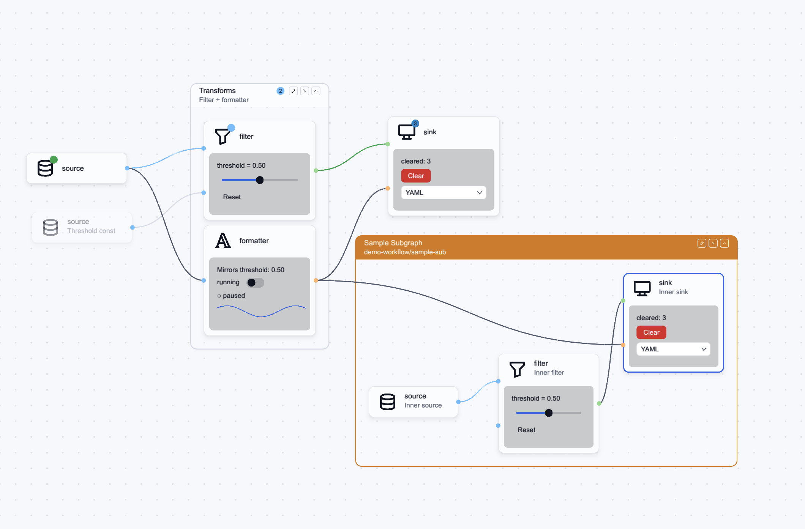

# blinc_node_editor

A metadata-driven node-graph editor toolkit built on
[`blinc_canvas_kit`]. Typed ports, bezier connectors with drag-to-
connect, immediate-mode content widgets inside node bodies, group
chrome, theme-aware rendering, frustum-culled paint, and a
signal + event API designed for reactive Blinc hosts.




The crate is generic over the host's port-type (`PortKind`) + per-
node / per-connection / per-group metadata (`<K, N, C, G>`). It
exposes a graph view; the host owns the authoritative graph state
and patches it in response to editor events.

[`blinc_canvas_kit`]: ../blinc_canvas_kit

## Status

Shipped. Built source-local to Blinc (git-pinned `blinc_core` /
`blinc_layout` / `blinc_canvas_kit` deps need a `[patch]` table in
the workspace root to resolve locally). See
[`ROADMAP.md`](ROADMAP.md) for the the long-term roadmap.

## Layering

```
host crate                  ← graph-runtime binding: model, port types, templates
blinc_node_editor           ← typed ports, connectors, palette types, layout
blinc_portal_ui             ← imgui-style widgets inside node body slots
blinc_canvas_kit            ← viewport, hit-testing, selection, drag, snap
blinc_core / blinc_layout   ← DrawContext, signals, Div/Canvas/Stateful
```

The host owns the model + the inspector / palette / minimap UI;
this crate owns the canvas, the graph data view, and the command +
event API hosts drive it with.

## Quick start

```rust
use blinc_node_editor::prelude::*;
use blinc_node_editor::{BadgeKind, Group, GroupId, StatusBadge};

let editor: NodeEditor<MyPortKind, (), (), ()> =
    NodeEditor::new("graph-1")
        .with_templates(build_templates())
        .with_snap(8.0);

editor.set_graph(nodes, connections, groups, exposed);
editor.element() // a Div the host mounts inside a full-screen Stateful
```

See [`examples/blinc_app_examples/examples/node_editor_demo.rs`](https://github.com/project-blinc/Blinc/blob/main/examples/blinc_app_examples/examples/node_editor_demo.rs)
in the Blinc workspace for a working setup wired to a `HostGraph`.

## Two design principles

1. **Metadata-driven.** Nodes + ports render from declarative
   `NodeTemplate`s carrying icon / subtitle / ports / config schema.
   Per-instance overrides on `NodeInstance` cover shape / icon /
   subtitle / variant / badge / disabled. Hosts never edit the
   renderer.
2. **Graph-model-agnostic.** Generic over `<K: PortKind, N, C, G>`.
   Compatibility logic lives in the host's `PortKind` impl, not in
   the editor — any DAG runtime plugs in by impl'ing `PortKind` for
   its own port type.

## Core types

| Type | Role |
| ---- | ---- |
| `NodeEditor<K, N, C, G>` | The view + command surface. Constructed once per canvas; clone-cheap. |
| `NodeTemplate<K>` | Declarative node shape — component name, ports, icon, content slot. |
| `NodeInstance<N>` | One placed node — id, position, per-instance overrides, host metadata. |
| `Connection<C>` | Typed edge between two `PortAddress`es with optional state + host metadata. |
| `Group<G>` | Visual grouping over a set of node ids, with collapse / disable / badge. |
| `PortDesc<K>` | A node template's port — direction, kind, label, description, optional position override. |
| `ConnectionState` | `Normal` / `Pending` / `Running` / `Success` / `Error` — drives edge animation + tint. |
| `StatusBadge` | Header badge — kind (`Running` / `Success` / `Info` / `Error` / `Warning`), count, tooltip. |
| `NodeIcon` | SVG-backed icon. Construct via `NodeIcon::from_svg_str(...)`. |
| `NodeContent` | Portal-ui closure rendered inside the node body. See [Node content slots](#node-content-slots). |
| `ConfigSchema` | Typed schema for a template's editable config — a list of `PropertyDefinition`s + an optional list of `PropertyRule`s. See [Property schema + rules engine](#property-schema--rules-engine). |
| `PropertyDefinition` | One inspector field — `Text` / `Textarea` / `Number` / `Boolean` / `Select` / `Color` / `File` / `CodeEditor` / `Custom`. Each variant carries per-kind validation + defaults. |
| `PropertyRule` | Reactive cascade: triggers + `Predicate` + `PropertyEffect`s. The editor applies rules whenever a config key changes; results emit as `NodeConfigChanged` events. |
| `InspectorPatchRequest` | One inspector edit — `{ node, path: flat-key, value }`. Hosts route it through `editor.apply_inspector_patch(...)` to run validation + the rule cascade. |
| `LayoutStrategy` | `Manual` (default) — `Layered(LayeredConfig)` for DAGs, `Force(ForceConfig)` for cyclic / organic graphs, both group-bbox-aware via a hierarchical pipeline. `Custom` accepts a host closure. |
| `ThemeResolver` / `NodeEditorTheme` | Theme tokens + per-host overrides for colors, radii, shadows, fonts. |

## Construction + configuration

```rust
NodeEditor::new(key: impl Into<String>) -> Self
    .with_templates(impl IntoIterator<Item = NodeTemplate<K>>)
    .add_template(NodeTemplate<K>)               // post-construction
    .with_theme(NodeEditorTheme)                 // override theme tokens
    .with_layout(LayoutStrategy)                 // default Manual
    .with_background(CanvasBackground)           // kit background (grid, dots, solid)
    .with_snap(spacing: f32)                     // enable snap-to-grid
```

Runtime config:

```rust
editor.set_snap_enabled(bool);
editor.snap_enabled() -> bool;
editor.snap_point(Point) -> Point;
editor.canvas_kit() -> &CanvasKit;               // for kit-level config (zoom, marquee)
```

## Graph mutations (granular)

Every method bumps `graph_signal` exactly once when state actually
changes:

```rust
editor.set_graph(nodes, connections, groups, exposed);   // bulk replace
editor.insert_node(NodeInstance<N>);
editor.remove_node(&NodeId);                              // also drops incident connections
editor.update_node_position(&NodeId, Point);              // respects snap-to-grid
editor.insert_connection(Connection<C>);
editor.remove_connection(ConnectionId);
editor.insert_group(Group<G>);
editor.remove_group(&GroupId);
editor.set_group_members(&GroupId, Vec<NodeId>);
editor.set_group_collapsed(&GroupId, bool);
```

## Runtime observability shortcuts

State-only updates that avoid the cost of a full `set_graph`:

```rust
editor.set_node_badge(&NodeId, Option<StatusBadge>);
editor.set_node_disabled(&NodeId, bool);
editor.set_group_disabled(&GroupId, bool);
editor.set_connection_state(ConnectionId, ConnectionState);
editor.flash_node(NodeId, FlashKind, Duration);          // transient highlight
```

## Selection

```rust
editor.select(&[NodeId]);
editor.select_one(&NodeId);
editor.add_to_selection(&NodeId);
editor.clear_selection();
editor.selected_node_ids() -> Vec<NodeId>;
editor.selected_connection_ids() -> Vec<ConnectionId>;
```

Selection lives on the underlying `CanvasKit`. Subscribe to
`editor.canvas_kit().selection_signal()` to react.

## Viewport

```rust
editor.focus_on_node(&NodeId);                            // pan + zoom to centre
editor.zoom_to_fit();                                     // frame all nodes
editor.zoom_to_selection();
editor.set_viewport(zoom: f32, pan: Point);
editor.viewport() -> CanvasViewport;
```

## Align + distribute

Operate on snapshots; no anchor moves toward an arbitrary point —
the target derives from the bundle's existing extent.

```rust
editor.align_nodes(&[NodeId], AlignEdge);
//   AlignEdge::{Left, Right, CenterX, Top, Bottom, CenterY}
//   `Left` / `Top` pick the bundle's minimum coord.
//   `Right` / `Bottom` pick the maximum.
//   `CenterX` / `CenterY` average every node's centre.

editor.distribute_nodes(&[NodeId], DistributeAxis);
//   DistributeAxis::{Horizontal, Vertical}
//   The two outermost nodes anchor; interior nodes space evenly.
//   No-op for `ids.len() < 3`.
```

Both route through `update_node_position`, so snap-to-grid +
`graph_signal` bump apply to every move.

## Single-entry command dispatch

Same surface as the granular methods, packaged into one enum for
hosts that want a uniform / queued / cross-thread channel.

```rust
editor.dispatch(EditorCommand::InsertNode(node));
```

Variants:

| Group | Variant |
| ----- | ------- |
| Graph mutation | `InsertNode`, `RemoveNode`, `UpdateNodePosition`, `InsertConnection`, `RemoveConnection`, `InsertGroup`, `RemoveGroup`, `SetGroupMembers`, `SetGroupCollapsed` |
| Selection | `Select`, `SelectOne`, `AddToSelection`, `ClearSelection` |
| Viewport | `FocusOnNode`, `ZoomToFit`, `ZoomToSelection`, `SetViewport { zoom, pan }` |
| Observability | `SetNodeBadge`, `SetNodeDisabled`, `SetGroupDisabled`, `SetConnectionState`, `FlashNode` |
| Bulk | `SetGraph { nodes, connections, groups, exposed }`, `ApplyLayout` |
| Layout actions | `AlignNodes(ids, AlignEdge)`, `DistributeNodes(ids, DistributeAxis)` |
| Composite | `Composite(Vec<EditorCommand>)` — sequence multiple commands as one atomic dispatch. Used by [History](#history) for compound inverses (re-insert node + incident edges + group membership in one undo step). |

## Signals (continuous observable state)

Each signal bumps on every change to its associated state; pair
with `derived(...)` or `effect_with_deps(...)` to react.

```rust
editor.graph_signal()       -> SignalId;   // any graph mutation
editor.drag_state_signal()  -> SignalId;   // drag-to-connect FSM transitions
editor.hover_signal()       -> SignalId;   // hovered node / port / edge changes
editor.events_signal()      -> SignalId;   // any EditorEvent pushed
editor.canvas_kit().viewport_signal()      // pan / zoom
editor.canvas_kit().selection_signal()     // selection set
editor.canvas_kit().interaction_signal()   // hover / active
```

Paired state getters (call from inside `derived` / `effect`):

```rust
editor.graph_revision()  -> u64;
editor.drag_state()      -> DragConnect;
editor.hovered()         -> Option<HoverTarget>;  // Node/Port/Edge/Group
editor.last_render_stats() -> RenderStats;        // { visible_nodes, total_nodes, ... }
```

## Events (discrete one-shots)

Drained reactively by depending on `events_signal()`:

```rust
let evts = editor.events_signal();
effect_with_deps([evts], move || {
    for evt in editor.drain_events() {
        match evt {
            EditorEvent::NodeDragged { id, position }   => host.move_node(id, position),
            EditorEvent::ConnectionAccepted(req)        => host.add_edge(req),
            EditorEvent::DeleteNodesRequested(ids)      => host.delete_nodes(ids),
            EditorEvent::DeleteConnectionRequested(id)  => host.delete_edge(id),
            EditorEvent::CreateGroupRequested(req)      => host.create_group(req),
            EditorEvent::AddToGroupRequested(req)       => host.add_to_group(req),
            EditorEvent::RemoveFromGroupRequested(req)  => host.remove_from_group(req),
            EditorEvent::ToggleCollapseRequested(req)   => editor.set_group_collapsed(&req.group, req.collapsed),
            EditorEvent::DeleteGroupRequested(req)      => host.delete_group(req.group),
            EditorEvent::LayoutApplied(positions)       => host.apply_layout(positions),
            EditorEvent::MultiSelectionSettled { node_ids, anchor_screen } => host.show_toolbar(node_ids, anchor_screen),
            EditorEvent::SelectionCleared               => host.hide_toolbar(),
            EditorEvent::NodeClicked { id, modifiers }  => host.handle_click(id, modifiers),
            EditorEvent::EdgeClicked { id }             => host.handle_edge_click(id),
            EditorEvent::ConnectionRejected { from, to, reason } => host.show_reject_toast(from, to, reason),
            EditorEvent::EditGroupTitleRequested { group, current, anchor_screen } => host.open_title_editor(group, current, anchor_screen),
            EditorEvent::EditGroupDescriptionRequested { group, current, anchor_screen } => host.open_description_editor(group, current, anchor_screen),
            EditorEvent::NodeConfigChanged { node, key, previous, value, from_rule } => {
                // Propagate the new value into the host's runtime model.
                // `from_rule=true` distinguishes cascade overrides from
                // direct user / inspector patches. See
                // [Property schema + rules engine](#property-schema--rules-engine).
                host.on_config_changed(node, key, previous, value, from_rule);
            }
            // Keyboard-originated one-shots (Cmd-A / Cmd-D / Cmd-Z / Cmd-Shift-Z):
            EditorEvent::SelectAllRequested            => host.select_all(),
            EditorEvent::DuplicateNodesRequested(ids)  => host.duplicate_nodes(ids),
            EditorEvent::UndoRequested                 => history.undo(&editor),
            EditorEvent::RedoRequested                 => history.redo(&editor),
        }
    }
});
```

`UndoRequested` / `RedoRequested` are one-shot signals — the editor
never tracks history itself. Hosts wire them to a `History` stack
([History](#history)) or to their own undo / redo engine. The
duplicate / select-all events are similarly host-defined: the
editor doesn't mint fresh `NodeId`s and doesn't presume what
"select all" means when off-canvas siblings exist.

## Validation callback (sync)

The only callback surface — used for drag-time validation where a
host needs to answer mid-gesture:

```rust
editor.on_connect_request(|req: &ConnectRequest<K>| -> ValidationOutcome {
    // Synchronous answer drives the in-flight preview line's
    // colour (green = accept, red = reject) BEFORE the gesture
    // settles. ValidationOutcome::Accept | RejectWithReason(s).
});
```

## Keyboard shortcuts

Built into the canvas div when the editor has focus (clicking the
canvas takes focus automatically). On macOS the modifier is `Cmd`;
on every other platform it is `Ctrl` — `blinc_core::events::Modifiers::command`
picks the right one and the editor reads it from the live
`KeyDown` event:

| Key | Action |
| --- | ------ |
| `Esc` | Cancel an in-flight drag-to-connect gesture (no-op otherwise so the host can route to dialogs). |
| `Shift` + `Delete` / `Shift` + `Backspace` | Fire `EditorEvent::DeleteNodesRequested` / `DeleteConnectionRequested` / `DeleteGroupRequested` for every selected entity. The Shift modifier is required so plain `Delete` / `Backspace` is released back to focused text widgets (search box, inline title editor) without the canvas hijacking the keystroke. |
| `Shift` + `D` | Toggle soft-disabled on every selected node + group. Mixed-state selections all flip together based on the first entity's state. The Shift modifier is required for the same reason as `Shift+Delete` — plain `D` belongs to focused text widgets so a search query containing `D` doesn't lose the character to the canvas-side disable toggle. |
| `Cmd` / `Ctrl` + `A` | Emit `EditorEvent::SelectAllRequested`. Host calls `editor.canvas_kit().set_selection(...)` with whatever shape "all" means for it. |
| `Cmd` / `Ctrl` + `D` | Emit `EditorEvent::DuplicateNodesRequested(node_ids)` carrying every `node:`-prefixed id in the current selection (suppressed when empty). Host mints fresh `NodeId`s + offsets the clone positions. |
| `Cmd` / `Ctrl` + `Z` | Emit `EditorEvent::UndoRequested`. Host pops its [History](#history) stack. |
| `Cmd` / `Ctrl` + `Shift` + `Z` | Emit `EditorEvent::RedoRequested`. |

`handle_key_down` is also exposed as a public method:

```rust
editor.handle_key_down(kc: KeyCode, mods: Modifiers) -> bool;
```

Returns `true` when the editor consumed the key. Hosts that own
their own canvas div (or want to layer shortcuts on top) can call
it directly to either intercept BEFORE the editor (skip the call)
or AFTER (check the bool and fall through to host shortcuts when
`false`). The default wiring (`canvas.on_key_down(...)`) is set up
automatically by `editor.element()`.

## History

Undo / redo lives in `History<K, N, C, G>` (re-exported from the
crate root). The editor never tracks history itself — it just
emits `UndoRequested` / `RedoRequested` events on `Cmd-Z` /
`Cmd-Shift-Z`. The host owns the stack, decides what counts as
one user gesture, and calls `History::undo` / `History::redo` from
its event drain.

The strategy is command-log + inverse, not full snapshots: each
entry stores the forward `EditorCommand` that was applied plus the
inverse needed to undo it. Memory is bounded by entry count (default
cap `100`, ~200 KB worst case) rather than graph size.

```rust
use blinc_node_editor::{History, CoalesceKey, EditorCommand};

let history: History<DemoPort, (), (), ()> = History::with_default_cap();
// or History::new(cap); cap of 0 silently discards every push.

// Record a single user edit.
history.push(
    EditorCommand::InsertConnection(conn.clone()),
    EditorCommand::RemoveConnection(conn.id),
    "Add Connection",
);

// Drag gestures collapse into one entry: every per-frame
// UpdateNodePosition shares the same CoalesceKey::DragNode(id),
// so a 60 fps drag is ONE undoable step.
history.push_coalesced(
    CoalesceKey::DragNode(id.clone()),
    EditorCommand::UpdateNodePosition(id.clone(), new_pos),
    EditorCommand::UpdateNodePosition(id, gesture_start_pos),
    "Move Node",
);

// Undo / redo dispatch against the editor with recording suspended,
// so the inverse doesn't re-land on the stack. The Option carries
// the entry's label for transient UI feedback.
if let Some(label) = history.undo(&editor) {
    host_resync_from_editor(&editor);
    toast(format!("Undid {label}"));
}
history.can_undo();           // -> bool
history.can_redo();           // -> bool
history.next_undo_label();    // -> Option<&'static str>
history.clear();              // swap-document boundary
```

Destructive edits use `EditorCommand::Composite` for the inverse —
e.g. `RemoveNode` undoes as a `Composite` re-inserting the node, every
incident connection, and each affected group's previous member
list. The editor's `graph_snapshot()` accessor is the cheapest way
to read the post-undo state back into a host mirror:

```rust
let (nodes, connections, groups, exposed) = editor.graph_snapshot();
```

### Host-defined transactions

Some gestures mutate state the editor doesn't know about (host
project file, preset library, inspector caches). `push_transaction`
records a pair of `Fn` closures that re-apply / reverse the gesture
in one shot, so the user still sees one undoable step:

```rust
let editor_t = editor.clone();
let host_t = host.clone();
let new_preset = preset.clone();
let old_preset = host.read_preset(&node_id);
history.push_transaction(
    {
        let editor_t = editor_t.clone();
        let host_t = host_t.clone();
        let new_preset = new_preset.clone();
        move || {
            host_t.apply_preset(&node_id, &new_preset);
            editor_t.set_node_badge(&node_id, Some(StatusBadge::info(0)));
        }
    },
    {
        move || {
            host_t.apply_preset(&node_id, &old_preset);
            editor_t.set_node_badge(&node_id, None);
        }
    },
    "Apply Preset",
);
```

Closures are `Fn + Send + Sync + 'static` (each entry can be
replayed any number of times). Recording is suspended for the
duration of the closure, so calling `history.push` from inside is
a no-op — no self-recording loops. Transactions never coalesce
(`push_coalesced` only folds over a back-most `Command` entry).

### Programmatic re-syncs

Runtime instrumentation that the user shouldn't be able to undo —
runtime badges from a deploy pipeline, connection-state ticks,
host re-syncs after a model swap — bypasses history. Either skip
the `push` entirely OR wrap with `with_recording_off`:

```rust
history.with_recording_off(|| {
    editor.set_graph(snapshot.nodes, snapshot.connections, snapshot.groups, snapshot.exposed);
});
```

`set_graph` is also the natural place to `history.clear()`: a new
document shouldn't let the user "undo" back into the previous one.

## Soft-disabled state

A node or group can be soft-disabled — visually ghosted, dataflow
appears broken at that point, no other state changes. Member
nodes inherit a disabled group's state without their own
`disabled` flag being touched.

```rust
NodeInstance::new(id, comp, pos).with_disabled(true);
Group::new(id, name).with_disabled(true);

editor.set_node_disabled(&id, true);
editor.set_group_disabled(&gid, true);
```

Rendering effect:

- Node body / header / icon / title / badge paint at
  `theme.node_disabled_alpha()` (default 0.45) via a single
  opacity push.
- Group chrome (backdrop, border, header text, badge, chevron)
  dims the same way when `Group.disabled`.
- Every edge incident to a disabled node renders in the faded
  `Pending` style regardless of the connection's own `state`.

## Node content slots

Templates can attach an immediate-mode UI rendered inside the node
body via [`blinc_portal_ui`]. The portal owns its own widget
storage + signal subscriptions; changes to any signal the closure
reads repaint the canvas on the next frame.

```rust
NodeTemplate::new("filter", "Filter")
    .with_icon(my_icon())
    .with_input(PortDesc::new("in", "in", Direction::Input, MyKind::Number))
    .with_output(PortDesc::new("out", "out", Direction::Output, MyKind::Boolean))
    .with_content(80.0, |node_id, ui| {
        ui.label(&format!("threshold = {:.2}", threshold.get()));
        ui.slider_signal(&threshold, 0.0..1.0);
        if ui.button("Reset").clicked {
            threshold.set(0.5);
        }
    });
```

The slot grows automatically: the height arg is a MIN, the portal
reports its consumed height and the body grows on the next frame
when the closure paints more. The portal also enforces rect-clip
along the inset corner so widgets and `allocate_painter` paint
can't bleed outside the slot.

See [`blinc_portal_ui/README.md`](../blinc_portal_ui/README.md) for
the widget catalogue (`label`, `button`, `slider`, `switch`,
`text_input`, each with a `_signal` form) + `allocate_painter` for
free-form draw (sparklines, sketches, custom visualisations) +
overlay-escape for popovers / dropdowns.

The closure above is the **static** path (you write the widgets). For
the **dynamic** path, where a host-supplied schema is composed into the
body automatically, see
[Schema-driven content slots](#schema-driven-content-slots-the-walker).

[`blinc_portal_ui`]: ../blinc_portal_ui

## Property schema + rules engine

Templates declare an editable config via a strongly-typed
[`ConfigSchema`](src/config.rs) — a list of `PropertyDefinition`s
the inspector renders as form widgets, plus an optional list of
`PropertyRule`s that drive reactive cascades when values change.

### Declaring a schema

```rust
use blinc_node_editor::prelude::*;

NodeTemplate::new("filter", "Filter")
    .with_input(PortDesc::new("in", "input", Direction::Input, MyKind::Number))
    .with_output(PortDesc::new("out", "pass?", Direction::Output, MyKind::Boolean))
    .with_property(
        NumberProperty::new("threshold", "Threshold")
            .description("Values >= this pass through")
            .default(0.5)
            .range(0.0, 1.0)
            .step(0.01),
    )
    .with_property(
        BooleanProperty::new("strict", "Strict mode")
            .description("Use > instead of >=")
            .default(false),
    )
    .with_property(
        SelectProperty::new("on_block", "On block")
            .option("drop", "Drop silently")
            .option("warn", "Log a warning")
            .option("error", "Raise an error")
            .default("warn"),
    )
```

Variants and their builders:

| Variant | Builder | Validation knobs |
| ------- | ------- | ---------------- |
| `Text` | `TextProperty::new(key, label)` | `placeholder`, `max_length` |
| `Textarea` | `TextareaProperty::new(key, label)` | `placeholder`, `rows` |
| `Number` | `NumberProperty::new(key, label)` | `min`, `max`, `range`, `step`, `integer`, `unit` |
| `Boolean` | `BooleanProperty::new(key, label)` | — |
| `Select` | `SelectProperty::new(key, label)` | `.option(value, label)` repeated, `multiple` |
| `Color` | `ColorProperty::new(key, label)` | `with_alpha` |
| `File` | `FileProperty::new(key, label)` | `accept(["png", "jpg", ...])` |
| `CodeEditor` | `CodeEditorProperty::new(key, label)` | `language`, `line_numbers`, `line_wrap` |
| `Custom` | `PropertyDefinition::Custom { meta, value }` | Opaque JSON payload for host-rendered widgets |

Every builder shares `.description(...)` + `.required(bool)`.

### Seeding + validating

```rust
use blinc_node_editor::prelude::{default_config, validate};

// Initial config for a freshly-inserted node — every property
// with a declared default lands at its key; rules run once over
// the seeded values so rule-driven defaults are honoured.
let initial = default_config(&template.config_schema);

// Inspector form generation: walk schema + current values together.
for field in blinc_node_editor::prelude::fields(&template.config_schema, &node.config) {
    // field.definition: &PropertyDefinition
    // field.current_value: Option<&Value>
    // field.issues: Vec<ValidationIssue>  (filtered to this field)
    render_widget(field);
}

// Validate the full config — duplicate keys, missing required
// values, out-of-range numbers, unknown select options, text
// max_length overflow. Returns `Vec<ValidationIssue>` partitioned
// by severity (Error / Warning).
let issues = validate(&template.config_schema, &node.config);
```

### Reactive rules

Rules declare a `triggers` list of keys, a `Predicate` over the
current config, and a list of `PropertyEffect`s (`Set` / `Clear`)
to apply when the predicate matches.

```rust
use blinc_node_editor::prelude::{Predicate, PropertyRule, JsonValue};

// Switching `on_block` to "error" implies strict semantics —
// auto-flip the `strict` toggle.
template = template.with_rule(
    PropertyRule::new()
        .trigger("on_block")
        .when(Predicate::Eq {
            key: "on_block".into(),
            value: JsonValue::String("error".into()),
        })
        .set("strict", JsonValue::Bool(true)),
);
```

`Predicate` composes: `Eq` / `NotEq` / `In` / `Truthy` / `Exists`
plus numeric `Gt` / `Lt` / `Gte` / `Lte`, and `All` / `Any` /
`Not` for boolean composition. `PropertyEffect` is one of `Set`
(write value) or `Clear` (remove key from config).

The cascade engine ([`cascade_rules`](src/config.rs)) iterates
rules until the config stabilises:

- Rules within a single cascade pass evaluate in schema declaration
  order. Effects from earlier rules are visible to later rules in
  the same pass via the live config.
- An effect that doesn't actually change the value (Set with the
  current value; Clear on a missing key) is a no-op and doesn't
  re-trigger the cascade. Most ping-pong rule pairs self-terminate.
- Cascades that genuinely keep changing values (e.g. a `Clear` +
  `Set` ping-pong) cap at `MAX_RULE_CASCADE_DEPTH = 16` iterations
  and emit a `tracing::warn!` if they bail.

### Applying patches

Three editor methods drive config mutations, all of which run the
rule cascade + emit `NodeConfigChanged` events + bump
`graph_signal`:

```rust
editor.patch_node_config(&node_id, "threshold", json!(0.8));
//   Returns Vec<ValidationIssue> for the post-cascade config.

editor.set_node_config(&node_id, full_config_object);
//   Diffs prev vs new at the key level; rules fire only for keys
//   whose value actually changed.

editor.apply_inspector_patch(&InspectorPatchRequest { node, path, value });
//   Thin wrapper over patch_node_config for the inspector event flow.
```

`InspectorPatchRequest.path` is a **flat key** — it matches the
top-level `PropertyMeta::key` on the schema, not a dotted path
into nested structures. Hosts with nested config layouts (e.g.
`config.connection.host`) merge themselves before dispatching, or
emit one request per leaf.

### Observing changes

Each cascade step fires its own `NodeConfigChanged` event so hosts
can observe the full trail:

```rust
EditorEvent::NodeConfigChanged {
    node: NodeId,
    key: String,         // PropertyMeta::key — flat
    previous: Value,     // pre-change value (Null if unset before)
    value: Value,        // post-change value (Null if cleared)
    from_rule: bool,     // false = user/host patch, true = rule cascade override
}
```

A user-driven patch that triggers a cascade emits TWO events for
the touched key: the user-intent write (`from_rule=false`) then the
rule override (`from_rule=true`). Useful for telemetry, history
(see [History](#history)), and propagating changes into the host's
runtime model.

## Schema-driven content slots (the walker)

The two sections above are independent: [content slots](#node-content-slots)
let you hand-write a Portal-UI closure in a node body, and the
[property schema](#property-schema--rules-engine) is a typed IR a host
inspector can render. The **walker** joins them: it interprets a
`ConfigSchema` (or a structured `ContentSchema`) directly into a live
Portal-UI form *inside the node body*, two-way-bound to the node's
`config`, with conditional interactivity driven by the rules engine.

This is the dynamic path to node content: the host describes fields and
rules as data, the walker composes the widgets. No widget code per node
type.

### Flat form: `walk_schema`

Hand the walker a schema and a `FieldAccess` bridge. `EditorFieldAccess`
is the turnkey bridge: it reads the node's `config` and writes edits
through `patch_node_config` (so each edit runs the rule cascade and
emits `NodeConfigChanged`).

```rust
use blinc_node_editor::prelude::*;

let schema = ConfigSchema::new()
    .with_property(NumberProperty::new("threshold", "Threshold").default(0.5).range(0.0, 1.0).step(0.01))
    .with_property(BooleanProperty::new("strict", "Strict").default(false))
    .with_property(SelectProperty::new("mode", "Mode").option("a", "A").option("b", "B").default("a"));

// Register the template AFTER the editor exists so the content
// closure can capture an editor handle for EditorFieldAccess.
let editor_handle = editor.clone();
editor.add_template(
    NodeTemplate::new("config", "Config")
        .with_config_schema(schema.clone())
        .with_content_size(220.0, 200.0, move |id, ui| {
            let mut access = EditorFieldAccess::new(editor_handle.clone(), id.clone());
            walk_schema(ui, &schema, &mut access, &WalkOptions::default());
        }),
);
```

Each `PropertyDefinition` maps to a widget: `Text`/`File` to a text
input, `Textarea`/`CodeEditor` to a textarea, `Number` to a slider
(when it has min+max) or a numeric input, `Boolean` to a switch,
`Select` to a cycle trigger, `Color` to a colour picker. `Custom` emits
nothing (render it yourself via a `CustomSlot`, below). Field state is
keyed by the property key, so caret / drag state survives across frames.

`WalkOptions` toggles `show_validation` (inline issue messages from
`validate`, glyph-prefixed since labels carry no colour) and
`mark_required` (a `*` on required labels). The walker recomputes from
`config` every frame, so external mutations (rule cascades, other
clients) appear on the next paint with no reconciliation.

### Custom binding: `FieldAccess`

`EditorFieldAccess` covers the common case. Implement `FieldAccess`
yourself to bind fields to anything else (a `State<Value>`, a CRDT, a
remote document):

```rust
pub trait FieldAccess {
    fn get(&self, key: &str) -> serde_json::Value;        // current value, Null if unset
    fn set(&mut self, key: &str, value: serde_json::Value); // user edited `key`
}
```

### Structured form: `walk_content` + `ContentSchema`

`ConfigSchema` is a flat field list. `ContentSchema` layers structure
over it by referencing properties by key, so the leaf vocabulary stays
unchanged. `ContentItem` is the tree:

- `Field(key)` renders one property.
- `Section { title, children }` / `Row(children)` compose layout.
- `When { when, children }` shows children only while a `Predicate`
  holds; `DisableWhen { when, children }` renders them disabled. This is
  declarative show / hide / enable, evaluated each frame against the
  live config. It never mutates config (that is what value-cascade
  `PropertyRule`s are for).
- `Repeater { key }` renders an editable row per element of a string
  array plus an add button.
- `CustomSlot(name)` invokes a host closure registered in a
  `SlotRegistry` — the escape hatch for charts, colour wheels, or any
  widget the IR does not cover, composed *inside* the tree.
- `Label(text)` / `Separator` for static structure.

```rust
let content = ContentSchema::new(schema.clone())
    .with(ContentItem::Section {
        title: "Validation".into(),
        children: vec![
            ContentItem::Field("mode".into()),
            ContentItem::Field("threshold".into()),
            // strict-window field shows only in strict mode
            ContentItem::When {
                when: Predicate::Eq { key: "mode".into(), value: JsonValue::from("strict") },
                children: vec![ContentItem::Field("strictWindow".into())],
            },
        ],
    })
    .field("note")
    .with(ContentItem::CustomSlot("preview".into()));

let mut slots: SlotRegistry = Default::default();
slots.insert("preview".into(), std::sync::Arc::new(|_id, ui| {
    ui.label("● host-rendered slot");
}));
let slots = std::sync::Arc::new(slots);

let editor_handle = editor.clone();
editor.add_template(
    NodeTemplate::new("config", "Config")
        .with_config_schema(schema.clone())
        .with_content_size(240.0, 320.0, move |id, ui| {
            let mut access = EditorFieldAccess::new(editor_handle.clone(), id.clone());
            walk_content(ui, &content, &mut access, id, &slots, &WalkOptions::default());
        }),
);
```

### How an edit flows

```
user moves the Threshold slider
  -> walk_* sees the widget's `changed`, calls access.set("threshold", v)
  -> EditorFieldAccess::set -> editor.patch_node_config(id, "threshold", v)
  -> config write + cascade_rules() fires dependent rules
  -> EditorEvent::NodeConfigChanged emitted per effect (observe via drain_events)
  -> next frame: the walker re-reads config; the slider and any
     cascaded field reflect the new values
```

Intra-form conditionals (`When` / `DisableWhen`) need no reactive graph:
the walker reads live values each frame. Cross-node reactivity rides
`graph_signal` as usual.

### Current limits

`Select` is a self-contained click-to-cycle trigger for now (a popover
picker is the planned upgrade). `Repeater` handles scalar string arrays
only; subform-per-row repeaters need path-scoped binding and are a
future extension.

## Frustum cull

`render_frame` skips nodes + edges whose bounds don't intersect
the visible canvas-content rect (inflated 25 % on each axis for
slack). The cull is transparent — read counts via
`editor.last_render_stats()`:

```rust
let s = editor.last_render_stats();
// RenderStats { visible_nodes, total_nodes, visible_edges, total_edges }
```

`total_*` excludes collapsed-group members (those are hidden, not
culled), so a HUD that reads this surface visualises only the
viewport effect.

## Theming

Every visible chrome value resolves through `ThemeResolver`:

```rust
editor.with_theme(NodeEditorTheme {
    node_corner_radius: Some(12.0),
    node_body_fill: Some(my_color),
    // every field is Option<_> — None falls back to the active
    // ThemeBundle's tokens (Surface, Border, Accent, etc.)
    ..NodeEditorTheme::default()
});
```

Theme swaps invalidate the slot cache via a bumped
`theme_revision`, so existing nodes re-layout cleanly.

## Auto-layout

```rust
editor.with_layout(LayoutStrategy::Manual);            // default; positions come from host
editor.with_layout(LayoutStrategy::Layered(LayeredConfig::default()));
editor.with_layout(LayoutStrategy::Force(ForceConfig::default()));
editor.apply_layout();                                 // fires LayoutApplied event with new positions
```

- `Manual` returns the host's `NodeInstance.position` values
  untouched.
- `Layered(LayeredConfig)` runs a Sugiyama-style pipeline
  (cycle-break → longest-path layering → median in-layer ordering
  → coordinate assignment) and emits left-to-right or top-to-bottom
  flows via `LayeredConfig.top_to_bottom`.
- `Force(ForceConfig)` runs Fruchterman-Reingold repulsion + edge-
  spring attraction. Suitable for cyclic / organic graphs.
- Both `Layered` and `Force` are **group-bbox-aware**: each group's
  members lay out internally first, then a super-graph of (groups
  + free nodes) lays out together, then group-relative positions
  resolve into the super-graph slot. A group keeps its members
  together regardless of the algorithm's global pull.
- `Custom(CustomLayoutFn)` invokes a host closure with the graph
  snapshot — useful for bespoke domain layouts.

Hosts subscribe to `EditorEvent::LayoutApplied(updates)` to commit
the new positions back into their model + drive an animated
transition.

## Subgraphs

`ExposedPort<K>` + `InternalTarget` + `NavigationCrumb` types exist
for declaring graph boundaries. The editor itself doesn't navigate
between graphs — the host pushes a crumb onto its own stack and
calls `set_graph` with the inner graph.

## Performance defaults that matter

- **Slot cache** — per-template node interior layout is computed
  off-render in `slot::warm_slot_cache` via rayon. Fingerprinted by
  template + per-instance overrides; cleared on theme changes.
- **Frustum cull** — see above.
- **Sliding port hysteresis** — none. Sides are pinned to
  `PortDesc::resolved_position()` (input → Left, output → Right by
  default; per-port override via `with_position`). Sort order
  within a side is sort-key driven so multi-port nodes pack toward
  their counterparts but no port ever crosses to another side.
- **Group auto-bounds** — computed from live `node_bounds_for`
  results, so portal-grown content nodes (whose body height grows
  beyond the template min) contribute their real extent.

## Crate layout

| Module | Contents |
| ------ | -------- |
| `editor` | `NodeEditor`, `RenderStats`, dispatch, all granular methods. |
| `node` | `NodeId`, `NodeTemplate`, `NodeInstance`, `NodeShape`, `NodeContent`. |
| `port` | `PortKind`, `PortDesc`, `PortAddress`, `PortPosition`, `PortMetadata`, `PortCategory`. |
| `connection` | `Connection`, `ConnectionId`, `ConnectionState`, `ConnectionEvent`, `ConnectRequest`, `ValidationOutcome`. |
| `group` | `Group`, `GroupId`, `StatusBadge`, `BadgeKind`, plus group-request types. |
| `event` | `EditorEvent` (incl. `UndoRequested` / `RedoRequested` / `DuplicateNodesRequested` / `SelectAllRequested`), `EditorCommand` (incl. `Composite`), `ClickModifiers`, `FlashKind`, `HoverTarget`, `AlignEdge`, `DistributeAxis`. |
| `history` | `History`, `HistoryEntry`, `CoalesceKey`, `TransactionFn`, `DEFAULT_CAP`. |
| `icon` | `NodeIcon` — SVG-backed icon resource. |
| `subgraph` | `ExposedPort`, `InternalTarget`, `NavigationCrumb`. |
| `layout` | `LayoutStrategy`, `apply_layout`, `LayeredConfig`, `ForceConfig`. |
| `interaction` | `DragConnect`, drag-membership classification helpers. |
| `theme` | `NodeEditorTheme`, `ThemeResolver`, all colour / radius / shadow accessors. |
| `render` | Free-function paint routines + `content_slot_rects`. |
| `slot` | Off-render layout compute + cache. |

## Roadmap

[`ROADMAP.md`](ROADMAP.md) tracks remaining work. Shipped:
sliding-port placement (direction-locked), align + distribute,
snap-to-grid, frustum cull, soft-disable (node + group), portal-ui
content slots, granular commands + event channel + signals,
keyboard shortcuts (`Esc`, `Shift+Delete` / `Shift+Backspace`,
`Shift+D`, `Cmd-A`, `Cmd-D`, `Cmd-Z`, `Cmd-Shift-Z`),
[History](#history) module
(command-log + inverse, drag coalescing, host-defined
transactions), context menu, inline group rename, layered + force
auto-layouts (group-bbox-aware), typed
[property schema + rules engine](#property-schema--rules-engine)
with `NodeConfigChanged` events, typed
[`RegionId`](src/region.rs) for canvas-kit hit-region keys.

## Building this crate

The crate's deps are git-pinned to upstream Blinc; build it
source-local to a Blinc checkout with a `[patch]` table redirecting
`blinc_core` / `blinc_layout` / `blinc_canvas_kit` / `blinc_gpu` /
`blinc_theme` / `blinc_svg` / `blinc_portal_ui` to their local
copies. The crate's own `Cargo.toml` already includes that patch
for development inside the Blinc tree.

To run the demo from the Blinc workspace root:

```bash
cargo run -p blinc_app_examples --example node_editor_demo \
  --features="node-editor tabler-icons cn"
```

## License

Apache-2.0.
